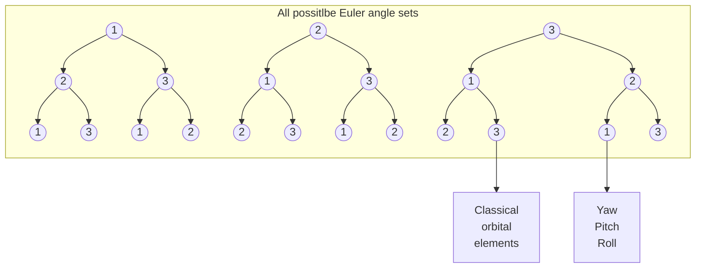

# AE_544_LecNote03\__Rigid_Body_Kinematics__Ch03.pdf

![[README#Disclaimers]]

Fun facts about rigid body attitude coordinates from authors:
1. A minimum of three coordinates is required to describe the relative angular displacement between two reference frames.
2. Any minimal set of three attitude coordinates will contain at least one geometrical orientation where the coordinates are singular, namely at least two coordinates are undefined or not unique.
3. At or near such a geometric singularity, the corresponding kinematic differential equations are also singular.
4. The geometric singularities and associated numerical difficulties can be avoided altogether through a regularization. Redundant sets of four or more coordinates exist that are universally determined and contain no geometric singularities.
5. Two rigid body (or coordinate frame) orientations can differ at most by a 180 deg rotation.

## Direction Cosine Matrix (DCM) Basics

The **vectrix** notation for two frames $\calN$ and $\calB$:
$$
\{ \nht{} \} \equiv \Bmt{ \nht{1} \\ \nht{2} \\ \nht{3} }
\qquad
\{ \bht{} \} \equiv \Bmt{ \bht{1} \\ \bht{2} \\ \bht{3} }
$$

![[fig-3-1-DCM.png|300]]

 The **direction cosine matrix** (DCM) $[C]$
 $$
\{ \bht{} \} = 
\begin{bmatrix}
\cos \alpha_{11} & \cos \alpha_{12} & \cos \alpha_{13} \\
\cos \alpha_{21} & \cos \alpha_{22} & \cos \alpha_{23} \\
\cos \alpha_{31} & \cos \alpha_{32} & \cos \alpha_{33}
\end{bmatrix}
\{\nht{}\} = \dcm{C} \{\nht{}\}
\tag{3.5}
$$
$$
\Bmt{ \bht{1} \\ \bht{2} \\ \bht{3} } = \begin{bmatrix}
\cos \alpha_{11} & \cos \alpha_{12} & \cos \alpha_{13} \\
\cos \alpha_{21} & \cos \alpha_{22} & \cos \alpha_{23} \\
\cos \alpha_{31} & \cos \alpha_{32} & \cos \alpha_{33}
\end{bmatrix} \cdot \Bmt{ \nht{1} \\ \nht{2} \\ \nht{3} } 
$$

$\dcm{C}$ is an orthogonal matrix with all those good and convenient features, for example, $\dcm{C}\inv = \dcm{C}\trans$.

The most powerful feature of the direction cosine is the ability to directly project (or transform) an arbitrary vector, with components written in one reference frame, into a vector with components written in another reference frame.

$$
\bm{v} = v_{b_1} \bht{1} + v_{b_2} \bht{2} + v_{b_3} \bht{3}
$$
$$
\bm{v} = v_{n_1} \nht{1} + v_{n_2} \nht{2} + v_{n_3} \nht{3}
$$

$$
\bmv_b = \dcm{C} \bmv_n
\tag{3.17}
$$

The **vectrix** of another frame $\calR$
$$
\{ \rht{} \} \equiv \Bmt{\rht1 \\ \rht2 \\ \rht3}
$$

Composition of reference frame changes: $\calN \to \calB \to \calR$
$$
\{ \rht{} \} = \dcm{C'} \textcolor{red}{ \{ \bht{} \} } = \mathrlap{\underbrace{\phantom{\dcm{C'}\dcm{C}}}_\text{composed}} \dcm{C'} \textcolor{red}{ \dcm{C} \{ \nht{} \}} = \underbrace{\dcm{C''}}_\text{as one} \{ \nht{} \}
\tag{Used 3.5}
$$
The direct transformation matrix from the first to the last cascading reference frame is clearly found by successive matrix-multiplications of each relative transformation matrix in reverse order as just shown.

>[!info]
> The direction cosine matrix is the most fundamental, but highly redundant, method of describing a relative orientation.
> The biggest asset of the direction cosine matrix is the ability to easily transform vectors from one reference frame to another.

## Kinematics using DCMs

The instantaneous angular velocity vector $\bmo$ of the $\calB$ frame relative to the $\calN$ frame, expressed in $\calB$ frame orthogonal components as
$$
\bmo = \omega_1 \bht1 + \omega_2 \bht2 + \omega \bht3
$$

>[!info] Expressed the body angular velocity in the body frame.

Then the derivative of the basis of a frame $\calB$ taken in another frame $\calN$ can be easily expressed as
$$
\ddtN \bht{i} = \ddtB \bht{i} + \bmo \times \bht{i}  
\tag{3.22}
$$

Define **skew-symmetric tilde matrix operator** such that for any given vector
$$
\bmx = \bmt{x_1 \\ x_2 \\ x_3} \in \bbR^3
$$
a matrix $\bmt{\tilde{\bmx}}$ is defined as following,
$$
\bmt{\tilde{\bmx}} = \bmt{\skewmt{x_1}{x_2}{x_3}}
$$
such that $\bmt{\tilde{\bmx}} = - \bmt{\tilde{\bmx}}\trans$.

For example, applying this title matrix operation to Eq. (3.22) for $\bht{1}$ in $\calB$ gives
$$
\begin{aligned}
(\bmo)_\calB \times (\bht{i})_\calB = \left( \bmt{\omega_1 \\ \omega_2 \\ \omega_3} \times \bmt{1 \\ 0 \\ 0} \right)_\calB
= \begin{vmatrix}
\bht1 & \bht2 & \bht3 \\
\omega_1 & \omega_2 & \omega_3 \\
1 & 0 & 0
\end{vmatrix} = \omega_3 \bht2 - \omega_2 \bht3 
= - \bmt{1 & 0 & 0} \bmt{\skewmt{\omega_1}{\omega_2}{\omega_3}} \Bmt{\bht1 \\ \bht2 \\ \bht3}
\end{aligned}
$$

>[!check] This operator is independent of coordinate transformations (Cartesian) and holds for abstract vectors.
> We want to show that the tilde operator doesn't change under a coordinate transformation from Cartesian frame $\calB$ to Cartesian frame $\calF$, where the orientation of $\calF$ is given by the DCM $\dcm{FB}$, which can be expressed as
> $$
> (\dcm{FB}(\bmo)_\calB) \times (\dcm{FB}(\bht{i})_\calB) = \dcm{FB} \left( (\bmo)_\calB \times (\bht{i})_\calB \right)
> \tag{to prove}
> $$
> First, let's prove a general rule for the tilde operator. For two generic vectors $\bmu$ and $\bmv$, after a transformation of DCM $\dcm{C}$, the new coordinates can be obtained as
> $$
> \bmu' = \dcm{C} \cdot \bmu   \qquad    \bmv' = \dcm{C} \cdot \bmv
> $$
> Using the definition of tilde operators, and plugging in the above transformed vectors, we have the first expression:
> $$
> \begin{aligned}
> \bmu \times \bmv &= - \bmt{\tilde{\bmu}} \cdot \bmv \\
> \bmu' \times \bmv' &= - \bmt{\tilde{\bmu'}} \cdot \bmv' = -\bmt{\tilde{\bmu'}} \cdot \dcm{C} \cdot \bmv
> \end{aligned}
> $$
> Since $\bmu' \times \bmv'$ and $\bmu \times \bmv$ themselves are also a vector, so the following relation holds as our second expression:
> $$
> \bmu' \times \bmv' = \dcm{C} \cdot ( \bmu \times \bmv ) = - \dcm{C} \cdot \bmt{\tilde{\bmu}} \cdot \bmv
> $$
> Equate the above two expressions and we have:
> $$
> - \bmt{\tilde{\bmu'}} \cdot \dcm{C} = - \dcm{C} \cdot \bmt{\tilde{\bmu}} 
> \implies
> \bmt{\tilde{\bmu'}} = \dcm{C} \cdot \bmt{\tilde{\bmu}} \cdot \dcm{C}\trans
> $$
> 
> Then let's apply this to our problem. After the coordinate transformation $\dcm{FB}$ ($\calB \to \calF$), the following derivation becomes apparent:
> $$
> \begin{aligned}
> (\textcolor{red}{ \dcm{FB}(\bmo)_\calB }) \times (\dcm{FB}(\bht{i})_\calB) 
> %&= (\bmo)_\calF \times (\bht{i})_\calF 
> %&= - \left(\bmt{\tilde{\bmo}}\right)_\calF \cdot (\bht{i})_\calF  \\
> &= - \textcolor{red}{ \dcm{FB} \cdot \left(\bmt{\tilde{\bmo}}\right)_\calB \cdot \dcm{FB}\trans } \cdot \dcm{FB} \cdot (\bht{i})_\calB  \\
> &= - \textcolor{red}{ \dcm{FB} \cdot \left(\bmt{\tilde{\bmo}}\right)_\calB \cdot {} } \left( \textcolor{red}{ \dcm{FB}\trans } \cdot \dcm{FB} \cdot (\bht{i})_\calB \right)  \\
> &= - \dcm{FB} \cdot \left(\bmt{\tilde{\bmo}}\right)_\calB \cdot (\bht{i})_\calB \\
> &= \dcm{FB} \left( (\bmo)_\calB \times (\bht{i})_\calB \right)
> \end{aligned}
> $$

Applying this tilde operator to Eq. (3.22), and we get a **vectrix** equation for the rate of the basis
$$
\ddtN \bht{i} = \ddtB \bht{i} + \bmo \times \bht{i}  
\tag{3.22 copied}
$$

$$
\ddtN \{ \bht{} \} = - \bmt{\tilde{\bmo}} \{ \bht{} \}
\tag{3.24}
$$

Take time derivate to Eq. (3.5)
$$
\{ \bht{} \} = \dcm{C} \{\nht{}\}
\tag{3.5 copied}
$$
$$
\ddtN \{ \bht{} \} = \ddtN \left( \dcm{C} \{\nht{}\} \right) = \textcolor{red}{ \left( \ddtN \dcm{C} \right) } \{\nht{}\} + \cancelto{\bm{0}}{ \dcm{C} \ddtN \{\nht{}\} }
\tag{3.25}
$$

Shorten the notation using $\ddtN\dcm{C} = \dot{\dcm{C}}$:
$$
\ddtN \{ \bht{} \} = \ddtN \left( \dcm{C} \{\nht{}\} \right) = \textcolor{red}{ \dot{\dcm{C}} } \{\nht{}\}
\tag{3.25 continued}
$$

>[!info] $\dcm{C}$ is $\bht{i}$ expressed in $\calN$ by $\nht{i}$, so $\dcm{C}$ is expressed in $\calN$.

Equate Eq. (3.25) and Eq. (3.24), we have 
$$
\textcolor{black}{ \dot{\dcm{C}} } \{\nht{}\} = - \bmt{\tilde{\bmo}} \{ \bht{} \} = - \bmt{\tilde{\bmo}} \dcm{C}\{\nht{}\}
\tag{used Eq. 3.5}
$$
Since this equation shall hold for the basis vectrix $\{\nht{}\}$ of any arbitrary frame $\calN$, so there must be
$$
\dot{\dcm{C}} = - \bmt{\tilde{\bmo}} \dcm{C}
\tag{3.27}
$$

It seems everything are expressed in the body frame $\calB$ now, but we still need the reference frame $\calN$ for calculation. 
But $\calN$ doesn't need to be inertial.
Using the [[#Explicit Frame Labeling (a textbook convention for notations) (Example 3.1)|explicit frame labelling]] notation by the authors, Eq. (3.27) can be expressed in a more explicit way as
$$
\dot{\dcm{BN}} = - \bmt{\tilde{\bmo}_{\calB/\calN}} \dcm{BN}
\tag{3.28}
$$
Now, it is clear that a reference frame $\calN$ is always needed to describe attitude/orientation.

>[!warning] to correct.
>But $\calN$ is arbitrary, so if $\calB(t)$ is time-varying and rotating, $\calB(t)$ at $t=t_0$ can be chosen as $\calN$. 
>In this way, $\calN$ is $\calB(t_0)$, and $\dcm{BN}(t_0) = \bm{I}_3$.

A major advantage of the kinematic differential equation for $\dcm{C}$ is that it is **linear** and **universally applicable**.
There are no geometric singularities present in the attitude description or its kinematic differential equations.

At the cost of having a highly redundant formulation.

>[!warning] During this discussion/derivation of kinematic equations, no vectors have been moved in space, only their coordinates are being transformed (or mapped as the term the authors used) from one frame to another.
>In other words, everything happened at a fixed instant of $t_0$, it's only when you start propagate the ODE in Eq. (3.28) from $t_0$ to $t>0$, the vector starts to change.

## Explicit Frame Labeling (a textbook convention for notations) (Example 3.1)

Denote $\dcm{FB}$ as the DCM of frame $\calF$ relative to $\calB$. 

Under this notation convention/system/definition, $\dcm{FB}$ ~~maps~~(change coordinate of vectors) written in $\calB$ into (coordinates of) vectors written in $\calF$. 

As summary:
$$
\begin{aligned}
\{ \fht{} \} &= \dcm{FB} \{ \bht{} \} \\
\bmt{r_{f_1} \\ r_{f_2} \\ r_{f_3}} = \left( \bmr \right)_\calF &= \dcm{FB} \left( \bmr \right)_\calB = \dcm{FB} \bmt{r_{b_1} \\ r_{b_2} \\ r_{b_3}} 
\end{aligned}
$$

## Euler Angles $(\theta_1, \theta_2, \theta_3)$
> [!info] The popularity of Euler angles stems from the fact that the relative attitude is easy to visualize for small angles.

The position of $\{\bht{}\}$ relative to $\{\nht{}\}$ is described by a sequence of three rigid rotations about prescribed body-fixed axes.

The three single-axis rotation matrices $\dcm{M_i(\theta)}$ are given by:
$$
\dcm{M_1(\theta)} = \bmt{1 & 0 & 0 \\ 0 & \cos \theta & \sin \theta \\ 0 & -\sin \theta & \cos \theta} 
\qquad
\dcm{M_2(\theta)} = \bmt{\cos \theta & 0 & -\sin \theta \\ 0 & 1 & 0 \\ \sin \theta & 0 & \cos \theta}
\qquad
\dcm{M_3(\theta)} = \bmt{\cos \theta & \sin \theta & 0 \\ -\sin \theta & \cos \theta & 0 \\ 0 & 0 & 1}
$$

![[tikz_elementary_rotation_matrix]] (TikZ plots for three elementary rotation matrix.)

>[!check] This $[M_i(\theta)]$ is the DCM of the rotated frame relative to the original frame.

Let the $(\alpha, \beta, \gamma)$ ($\alpha, \beta, \gamma \in \{1,2,3\}$ are indices) Euler angle sequence be $(\theta_1, \theta_2, \theta_3)$ ($\theta_i$ are angles in radian by default), the direction cosine matrix **of the rotated frame relative to the original frame** is given as
$$
\dcm{C(\theta_1, \theta_2, \theta_3)} = \dcm{M_\gamma(\theta_3)} \cdot \dcm{M_\beta(\theta_2)} \cdot \dcm{M_\alpha(\theta_1)}
\tag{3.33}
$$

>[!warning] Here, using the textbook convention, Euler angle order and DCM multiplication order is reversed.

All possible Euler Angle sets (a permutation problem requiring different adjacent elements):

Two types:
- Asymmetric Euler angle set: 1st and 3rd rotations around different body frame axis
- Symmetric Euler angle set: 1st and 3rd rotations around the same body frame axis

>[!warning] The term "symmetric" doesn't mean the order can be changed!

### Asymmetric (3-2-1) Euler angles

In particular, for (3-2-1) Euler angle ($\theta_1$, $\theta_2$, $\theta_3$), the full DCM can be resolved as:
$$
\dcm{C}_\text{3-2-1} =
\begin{bmatrix}
\textcolor{red}{ c{\theta_2} c{\theta_1} } & \textcolor{red}{ c{\theta_2} s{\theta_1} } & \textcolor{green}{ -s{\theta_2} } \\
s{\theta_3} s{\theta_2} c{\theta_1} - c{\theta_3} s{\theta_1} & s{\theta_3} s{\theta_2} s{\theta_1} + c{\theta_3} c{\theta_1} & \textcolor{blue}{ s{\theta_3} c{\theta_2} } \\
c{\theta_3} s{\theta_2} c{\theta_1} + s{\theta_3} s{\theta_1} & c{\theta_3} s{\theta_2} s{\theta_1} - s{\theta_3} c{\theta_1} & \textcolor{blue}{ c{\theta_3} c{\theta_2} }
\end{bmatrix}
\tag{3.34, Didn't verify.}
$$
where $c \equiv\cos$ and $s\equiv\sin$. 
This is most useful to convert from DCM to Euler angles, which leads to 
$$
\begin{aligned}
(\theta_1)_\text{3-2-1} &= \tan\inv \left(\textcolor{red}{ \frac{C_{12}}{C_{11}} }\right) \\
(\theta_2)_\text{3-2-1} &= -\sin\inv \textcolor{green}{ \left(C_{13}\right) } \\
(\theta_3)_\text{3-2-1} &= \tan\inv \left(\textcolor{blue}{ \frac{C_{23}}{C_{33} }}\right)
\end{aligned}
\tag{Find through observations of elements.}
$$

This corresponds to the standard yaw-$\psi$, pitch-$\theta$, roll-$\phi$ set, which is a (3-2-1) Euler angle set. 
![[fig-3-2_yaw_pitch_roll_321.png|300]] 
**To transform components of a vector in the $\calN$ frame into the $\calB$ frame.**
So, (yaw-$\psi$, pitch-$\theta$, roll-$\phi$) transforms another frame $\calN$ to  to the body frame $\calB$, i.e., it gives the attitude of $\calN$ relative to $\calB$:
$$
\{\bht{}\} = \dcm{BN} \{\nht{}\} = \dcm{C}_\text{3-2-1} \{\nht{}\}
$$

### Symmetric (3-1-3) Euler angles

In particular, for (3-1-3) Euler angle ($\theta_1$, $\theta_2$, $\theta_3$), the full DCM can be resolved as:
$$
\dcm{C}_\text{3-1-3} =
\begin{bmatrix}
c\theta_3 c\theta_1 - s\theta_3 c\theta_2 s\theta_1 & c\theta_3 s\theta_1 + s\theta_3 c\theta_2 c\theta_1 & \textcolor{blue}{ s\theta_3 s\theta_2 } \\
-s\theta_3 c\theta_1 - c\theta_3 c\theta_2 s\theta_1 & -s\theta_3 s\theta_1 + c\theta_3 c\theta_2 c\theta_1 & \textcolor{blue}{ c\theta_3 s\theta_2 } \\
\textcolor{red}{ s\theta_2 s\theta_1 } & \textcolor{red}{ -s\theta_2 c\theta_1 } & \textcolor{green}{ c\theta_2 }
\end{bmatrix}
\tag{3.36, Didn't verify.}
$$
where $c \equiv\cos$ and $s\equiv\sin$. 
This is most useful to convert from DCM to Euler angles, which leads to 
$$
\begin{aligned}
(\theta_1)_\text{3-1-3} &= \tan\inv \left(\textcolor{red}{ \frac{C_{31}}{-C_{32}} }\right) \\
(\theta_2)_\text{3-1-3} &= \cos\inv \textcolor{green}{ \left(C_{33}\right) } \\
(\theta_3)_\text{3-1-3} &= \tan\inv \left(\textcolor{blue}{ \frac{C_{12}}{C_{23} }}\right)
\end{aligned}
\tag{Find through observations of elements.}
$$

![[fig-3-4_orbital_elements_313.png|300]] The ascending node-$\Omega$, inclination-$i$, and argument of the periapsis $\omega$ is a (3-1-3) Euler angle set. 
Similarly, $(\Omega, i, \omega)$ transforms $\calN$ to $\calB$, i.e., it gives the attitude of $\calN$ relative to $\calB$:
$$
\{\bht{}\} = \dcm{BN} \{\nht{}\} = \dcm{M_3(\omega)} \dcm{M_1(i)} \dcm{M_3(\Omega)} \{\nht{}\}
$$
$$
\begin{aligned}
\{\fht{after-\Omega}\} &= \textcolor{red}{ \dcm{M_3(\Omega)} \{\nht{}\} } \\
\{\fht{after-i}\} &= \textcolor{green}{ \dcm{M_1(i)} \{\fht{after-\Omega}\} } \\
\{\fht{after-\omega}\} &= \textcolor{blue}{ \dcm{M_3(\omega)} \{\fht{after-i}\} } \\
\{\bht{}\} &= \{\fht{after-\omega}\}  \\
&= \textcolor{blue}{ \dcm{M_3(\omega)} \{\fht{after-i}\} } \\
&= \textcolor{blue}{ \dcm{M_3(\omega)} } \textcolor{green}{ \dcm{M_1(i)} \{\fht{after-\Omega}\} } \\
&= \textcolor{blue}{ \dcm{M_3(\omega)} } \textcolor{green}{ \dcm{M_1(i)} } \textcolor{red}{ \dcm{M_3(\Omega)} \{\nht{}\} } \\
\end{aligned}
$$

>[!info] When specifying Euler angle sets, it must be clear which frame is the reference. There must be two frames involved: one serves as the reference, the other is the one gets rotated. 
>The **vectrix** only unifies directions of **change of basis/frame** and **coordinate transformation** in mathematical expression.
>
>Physically, the "directions" of **change of basis/frame** and **coordinate transformation** are always "opposite", regardless of the mathematical conventions and notations.

Note that each of the 12 possible sets of Euler angles has a **geometric singularity** where two angles are not uniquely defined.

>[!question]- What is the **singularity** of Euler angles? (Explain without touching kinematics yet)
> "Singularity" usually means something doesn't work, abnormal, ill-defined, unexpected, or giving infinity.
> DCM has no singularity, if one cannot resolve a set of Euler angles from DCM, then it's a singularity of that particular set of Euler angles.
> 
> Go back and check Eqs. (3.34) and (3.36).

## Kinematics using Euler angles

To avoid having to integrate the direction cosine matrix directly given an $\bmo$ time history, the Euler angle kinematic differential equations are needed.

>[!check] The following derivation is the same to any set of Euler angles.

Starting from the expression of the angular velocity $\bmo$ in the body frame $\calB$:
$$
\bmo = \omega_1 \bht{1} + \omega_2 \bht{2} + \omega_3 \bht{3}
$$

Here the (3-2-1) Euler angle set (yaw-$\theta_1$-$\psi$, pitch-$\theta_2$-$\theta$, roll-$\theta_3$-$\phi$ ) is used as an example. 
![[fig-3-3_yaw_pitch_roll_steps_321.png|400]]
Another expression of $\bmo$ using Fig. 3.3 can be obtained as:
$$
\bmo = \dot{\psi} \nht{3} + \dot{\theta} \bht{2}' + \dot{\phi} \bht{1}
\tag{3.53}
$$
where $\bht{2}'$ above is the $\bht{2}$ (after pitch, before roll) on the third subplot in the order given by gigantic arrows, and $\nht{3}$ is apparent.
Next is to find expressions for $\bht{2}'$ and $\nht{3}$ in the body frame $\calB$.
$$
\bht{2}' = \cos \phi \bht{2} - \sin \phi \bht{3}
\tag{From the fourth plot}
$$
$$
\nht{3} = -\sin \theta \bht{1} + \sin \phi \bht{2} + \cos \phi \cos \theta \bht{3}
\tag{Get from Eq. (3.34)}
$$

Simply plugging in and get:
$$
\begin{align}
\bmo &= \dot{\psi} (-\sin \theta \bht{1} + \sin \phi \bht{2} + \cos \phi \cos \theta \bht{3}) + \dot{\theta} (\cos \phi \bht{2} - \sin \phi \bht{3}) + \dot{\phi} \bht{1} \\
&= (-\dot{\psi} \sin \theta + \dot{\phi}) \bht{1} + (\dot{\psi} \sin \phi + \dot{\theta} \cos \phi ) \bht{2} + (\cos \phi \cos \theta - \dot{\theta} \sin \phi) \bht{3} \\
&= \hspace{5em} \omega_1 \bht{1} \hspace{6.5em} + \omega_2 \bht{2} \hspace{7.8em} + \omega_3 \bht{3}   \tag{compare with 3.53}
\end{align}
$$
or
$$
\coordin{\calB}{\bmt{\omega_1 \\ \omega_2 \\ \omega_3}} = 
\bmt{-\sin \theta & 0 & 1 \\ \sin \phi \cos \theta & \cos \phi & 0 \\ \cos \phi \cos \theta & -\sin \phi & 0}
\bmt{\dot{\psi} \\ \dot{\theta} \\ \dot{\phi}}
$$

Finally, the kinematic ODE of (3-2-1) Euler angle set  (yaw-$\theta_1$-$\psi$, pitch-$\theta_2$-$\theta$, roll-$\theta_3$-$\phi$ )  is obtained by inversing the above equation, which gives:
$$
\bmt{\dot{\psi} \\ \dot{\theta} \\ \dot{\phi}} 
= \frac{1}{\cos \theta} \bmt{0 & \sin \phi & \cos \phi \\ 0 & \cos \phi \cos \theta & -\sin \phi \cos \theta \\ \cos \theta & \sin \phi \sin \theta & \cos \phi \sin \theta} \cdot \coordin{\calB}{\bmt{\omega_1 \\ \omega_2 \\ \omega_3}}
\tag{3.57}
$$

---

Similarly, the ODE for (3-1-3) Euler angle set can be obtained as

$$
\bmt{\dot{\theta_1} \\ \dot{\theta_2} \\ \dot{\theta_3}} 
= \frac{1}{\sin \theta_2} \bmt{\sin \theta_3 & \cos \theta_3 & 0 \\ \cos \theta_3 \sin \theta_2 & -\sin \theta_3 \sin \theta_2 & 0 \\ -\sin \theta_3\cos \theta_2 & -\cos \theta_3\cos \theta_2 & \sin \theta_2} \cdot \coordin{\calB}{\bmt{\omega_1 \\ \omega_2 \\ \omega_3}}
\tag{3.59}
$$

>[!question] Revisit singularity of Euler angle sets from the perspective of kinematics equations above.
> - For (3-2-1), or general asymmetric sets, $\cos \theta = 0$ (2nd angle) gives a singularity in Eq. (3.57).
> - For (3-1-3), or general symmetric sets, $\sin \theta_2 = 0$ (2nd angle) gives a singularity in Eq. (3.59). 

>[!info] Drawbacks of Euler angle set:
> - A rigid body or reference frame is <u>never further than a 90-deg rotation away from a singular orientation</u>. 
> - Their kinematic differential equations are fairly nonlinear, containing computationally <u>intensive trigonometric functions</u>.
> - The linearized Euler angle kinematic differential equations are valid only for a relatively small domain of rotations.

## Principal Rotation Vector $(\eht{}, \Phi)$

>[!info] Theorem 3.1 (Euler’s Principal Rotation) 
>A rigid body or coordinate reference frame can be brought from an arbitrary initial orientation to an arbitrary final orientation by a single rigid rotation through a principal angle $\Phi$ about the principal axis $\eht{}$; the principal axis is a judicious axis fixed in both the initial and final orientation.

Let the principal axis unit vector $\eht{}$ be written in $\calB$ and $\calN$ frame components as
$$
\begin{aligned}
\eht{} &= e_{b_1} \bht1 + e_{b_2} \bht2 + e_{b_3} \bht3 \\
\eht{} &= b_{n_1} \nht1 + e_{n_2} \nht2 + e_{n_3} \nht3 \\
\end{aligned}
$$
so, they will have the same vector components in the two frames, which leads to
$$
\col{e_1 \\ e_2 \\ e_3} = \dcm{C} \col{e_1 \\ e_2 \\ e_3}
$$
the principal axis unit vector $\bht{}$ is the unit eigenvector of $\Phi$ corresponding to the eigenvalue $+1$.
Thus the proof of the principal rotation theorem reduces to proving the $\Phi$  has an eigenvalue of $+1$.

>[!info]- Logic to prove $\dcm{C}$ has only one eigenvalue $+1$. 
>Because $\det(\dcm{C}) = \lambda_1 \lambda_2 \lambda_3 = 1$ and all $\lambda_i$ are on the unit circle:
>- if two of them are $+1$ (let's say $\lambda_1=\lambda_2=1$), there must be $\lambda_3=1$, which leads to a zero rotation.
>- if none of them are $+1$, let's say $\lambda_1 = \bar{\lambda}_2$ are conjugate to each other, then $\lambda_3$ must be real and thus $\pm1$. Since we also assumed a right-handled frame, $\lambda_3=+1$, which is contradicting.

The eigenvector corresponding to $+1$ is unique to within a sign of $\eht{}$ and $\Phi$, except for the case of a zero rotation.
The sets $(\eht{}, \Phi)$ and $(-\eht{}, -\Phi)$ both describe the same orientation, so the lack of sign uniqueness will not cause any practical problems.

![[fig-3-8_two_principle_rotation_angles.png|300]]

**Conversions between principal axis and DCM**

The direction cosine matrix can be directly extracted from Eq. (3.70) to be
$$
[\bm{C}] =
\begin{bmatrix}
e_1^2 \Sigma + c\Phi & e_1 e_2 \Sigma + e_3 s\Phi & e_1 e_3 \Sigma - e_2 s\Phi \\
e_2 e_1 \Sigma - e_3 s\Phi & e_2^2 \Sigma + c\Phi & e_2 e_3 \Sigma + e_1 s\Phi \\
e_3 e_1 \Sigma + e_2 s\Phi & e_3 e_2 \Sigma - e_1 s\Phi & e_3^2 \Sigma + c\Phi
\end{bmatrix}
\tag{3.72}
$$
where $\Sigma = 1 - c\Phi$.

The inverse transformation from the direction cosine matrix 1⁄2C to the principal rotation elements is found to be
$$
\cos \Phi = \frac{1}{2} \left( C_{11} + C_{22} + C_{33} - 1 \right)
\tag{3.73}
$$
$$
\eht{} = \col{e_1\\e_2\\e_3} = \frac{1}{2\sin \Phi} \col{C_{23}-C_{32}\\C_{31}-C_{13}\\C_{12}-C_{21}}
\tag{3.74}
$$

>[!note] Verifying textbook derivation.
> ![[fig-3-9_rotate_ni_to_ei.png|300]]
> To find the direction cosine matrix $\dcm{C}$ in terms of the principal rotation components $\eht{}$ and $\Phi$, the fact is used that each reference frame base vector $\nht{i}$ is related to $\bht{i}$ through a single axis rotation about $\eht{}$
> $$
> \bm{\hat{b}}_i = \cos \xi_i \bm{\hat{e}} + \sin \xi_i \bm{\hat{u}}' = e_i \bm{\hat{e}} + \sin \xi_i \bm{\hat{u}}'
> \tag{3.64}
> $$
> 
> $$
> \bm{\hat{u}}' = \cos \Phi \bm{\hat{u}} + \sin \Phi \bm{\hat{v}}
> \tag{3.65}
> $$
> 
> $$
> \bm{\hat{v}} = \frac{\bm{\hat{e}} \times \bm{\hat{n}}_i}{|\bm{\hat{e}} \times \bm{\hat{n}}_i|} = \frac{1}{\sin \xi_i} (\bm{\hat{e}} \times \bm{\hat{n}}_i)
> \tag{3.66}
> $$
> $$
> \bm{\hat{u}} = \bm{\hat{v}} \times \bm{\hat{e}} = \frac{1}{\sin \xi_i} (\bm{\hat{e}} \times \bm{\hat{n}}_i) \times \bm{\hat{e}} = \frac{1}{\sin \xi_i} \left( \bm{\hat{n}}_i - e_i \bm{\hat{e}} \right)
> \tag{3.67 and 3.69}
> $$
> 
> Plug in (3.65), (3.66), and (3.69) into Eq. (3.64)
> $$
> \begin{aligned}
> \bm{\hat{b}}_i &= e_i \bm{\hat{e}} + \sin \xi_i \bm{\hat{u}}' \\
> &= e_i \eht{} + \sin \xi_i (\cos \Phi \bm{\hat{u}} + \sin \Phi \bm{\hat{v}})  \\
> &= e_i \eht{} + \sin \xi_i (\cos \Phi (\frac{1}{\sin \xi_i} \left( \bm{\hat{n}}_i - e_i \bm{\hat{e}} \right)) + \sin \Phi (\frac{1}{\sin \xi_i} (\bm{\hat{e}} \times \bm{\hat{n}}_i)))  \\
> &= e_i \eht{} + \cos \Phi \left( \bm{\hat{n}}_i - e_i \bm{\hat{e}} \right) + \sin \Phi (\bm{\hat{e}} \times \bm{\hat{n}}_i)  \\
> &= \cos \Phi \bm{\hat{n}}_i + ( 1 - \cos \Phi ) e_i \eht{} - \sin \Phi [\tilde{\bm{e}}] \bm{\hat{n}}_i) \\
> &= \cos \Phi \bm{\hat{n}}_i + ( 1 - \cos \Phi ) \eht{} (\eht{} \cdot \nht{i}) - \sin \Phi [\tilde{\bm{e}}] \bm{\hat{n}}_i) \\
> &= \cos \Phi \bm{\hat{n}}_i + ( 1 - \cos \Phi ) \eht{} (\eht{}\trans \nht{i}) - \sin \Phi [\tilde{\bm{e}}] \bm{\hat{n}}_i) \\
> &= \cos \Phi \bm{\hat{n}}_i + ( 1 - \cos \Phi ) (\eht{} \eht{}\trans) \nht{i} - \sin \Phi [\tilde{\bm{e}}] \bm{\hat{n}}_i) \\
> \end{aligned}
> $$
> $$
> \begin{aligned}
> \bm{\hat{b}}_1 = \cos \Phi \bm{\hat{n}}_1 + ( 1 - \cos \Phi ) (\eht{} \eht{}\trans) \nht{1} - \sin \Phi [\tilde{\bm{e}}] \bm{\hat{n}}_1) \\
> \bm{\hat{b}}_2 = \cos \Phi \bm{\hat{n}}_2 + ( 1 - \cos \Phi ) (\eht{} \eht{}\trans) \nht{2} - \sin \Phi [\tilde{\bm{e}}] \bm{\hat{n}}_2) \\
> \bm{\hat{b}}_3 = \cos \Phi \bm{\hat{n}}_3 + ( 1 - \cos \Phi ) (\eht{} \eht{}\trans) \nht{3} - \sin \Phi [\tilde{\bm{e}}] \bm{\hat{n}}_3) \\
> \end{aligned}
> $$
> $$
> \{\bht{}\} = \cos \Phi [I_{3 \times 3}] \{\nht{}\} + (1 - \cos \Phi) \bm{\hat{e}} \bm{\hat{e}}^T \{\nht{}\} - \sin \Phi [\bm{\tilde{e}}] \{\bm{\hat{n}}\}
> $$
> 
> $$
> \bm{\hat{b}}_i = \cos \Phi \bm{\hat{n}}_i + (1 - \cos \Phi) \bm{\hat{e}} \bm{\hat{e}}^T \bm{\hat{n}}_i + \sin \Phi (\bm{\hat{e}} \times \bm{\hat{n}}_i)
> \tag{3.70}
> $$
> 
> $$
> \{\bm{\hat{b}}\} = \left( \cos \Phi [I_{3 \times 3}] + (1 - \cos \Phi) \bm{\hat{e}} \bm{\hat{e}}^T - \sin \Phi [\bm{\tilde{e}}] \right) \{\bm{\hat{n}}\}
> \tag{3.71}
> $$

The principal rotation vector $\bm{\gamma}$ is defined as
$$
\bm{\gamma} = \Phi \eht{}
\tag{3.77}
$$
then
$$
\bmt{\tilde{\bm{\omega}}} = \dot{\Phi} \bmt{\tilde{\bm{e}}}
\tag{3.79}
$$

---

## Euler Parameters $\bmbet$ (Quaternions $\bm{q}$)

## Classical Rodrigues Parameters

## Modified Rodrigues Parameters

## Homogeneous Transformations

